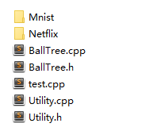
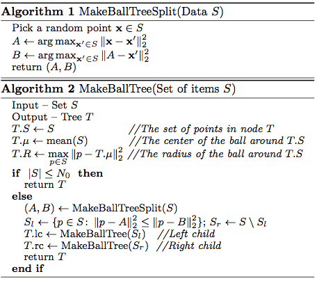
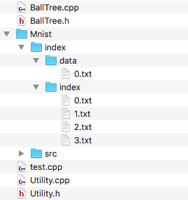
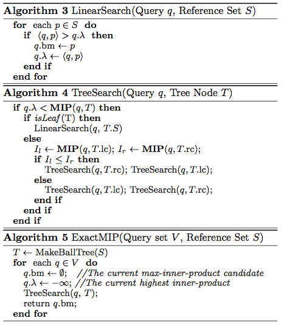

# BallTree-MIPS

球树-最大内积搜索

* DDL: 6月7号

<br />

## 测试方法

* **说明：每个球的x点是随机选的，所以每次的answer有可能不一样，但是每次的answer的最大内积是相同的**
* 这里的文件夹为：


* 所有代码文件都在 BallTree/src当中，其中包括以下文件夹：



* 每次代码运行的时候，将数据集拷贝到src文件目录下，BallTree/src/"dataSetName"/index 里面必须要有 index 和 data文件夹，运行的时候才能将树 store 到这些文件夹里。如下所示：


* 这些所有都准备好了后，运行test.cpp，修改要读的数据集，然后运行即可。
* 谢谢！

<br />

## 小组成员及贡献

|   **张玄镐**    |    艾力亚尔      |     吴志滨      |     张睿      |     任洪坤      |
| :----------: | :----------: | :----------: | :----------: | :----------: |
| **15331403** | **15331002** | **15331318** | **15331399** | **15331264** |
| **28%** | **27%** | **20%** | **10%** | **15%** |

<br / >

## 分工

|  **模块**  |     成员      |
| :------: | :---------: |
|  **建树**  | **张玄镐 艾力亚尔** |
| **写入外存** | **艾力亚尔  张玄镐** |
| **写进内存** | **吴志滨 张睿** |
| **搜索查询** |   **张玄镐**   |
| **程序优化** |  **全体成员**   |
| **总结报告** | **吴志滨 任洪坤** |

<br />

## 总述

* 数据结构

```c++
BallTree      树
ballTreeNode  树节点
```

* 说明：

  ​	建树过程，基本按照论文伪代码实现。而在读写文件过程，我们讨论后，决定分开叶子节点的数据集和节点的其他信息存储（具体下面任务3处有介绍），索引页，这里泛指存储所有节点的基础信息，就像身份证一样，有index、rightIndex、radius、dimension等等。而数据页，则是存储每个叶子节点里面的数据集，一个tableSize（数据集的大小，也即里面有多少个向量），data（向量集）。搜索过程，按照论文的具体方法实现。

* BallTreeNode的数据结构：


```c++
struct ballTreeNode {
  int index;//球的序号
  int indexRight;//球的右节点序号
  int indexData;//数据的序号
  float radius;  //球的半径
  float *mean;   //球的圆心
  int dimension; // 向量维度

  // 左右子节点
  ballTreeNode *left;
  ballTreeNode *right;

  // 数据集
  float **data;
  int tableSize;

  ballTreeNode();
  ballTreeNode(float radius, float *mean, int dimension);

  /* 遍历存储索引文件
   * @param dir_path 文件夹目录
   * @param slotNum 一页里槽的数量
   * pid = index / slotNum, slotId = index % slotNum
   */
  void storeIndexTraversally(ofstream &out, const char* dir_path, int slotNum);

  /* 页号 槽号
   * @param slotNum: indexSlotNum or dataSlotNum
   */
  int getPageId(int slotNum); // slotNum: 槽的大小 (bytes)
  int getSlotId(int slotNum);
};
```
<br />

## 任务1:实现ball-tree的建树过程(20分)

**类图设计：**

* Ball Tree Construction 伪代码:



* **函数设计如下：**

```c++
// 任务1：建树
bool buildTree(
  int n,
  int d,
  float** data);
// 计算圆心
void getCenter(float *&center, float **dataSet, int numberOfData);
// 计算半径
void getRadius(float &radius, float **dataSet, int numberOfData, float *center);
// 计算两个向量的距离
float getDistance(float *x, float *y);

// 建树代码
bool makeBallTreeSplit(int numberOfData, float **dataSet, float *&A, float *&B);
bool makeBallTree(ballTreeNode*& node, int numberOfData, float **dataSet);
float* getFarthestPoint(float *x,  float **dataSet, int n);
```
<br />

## 任务2: 实现将ball-tree写进外存的功能(30分)

> **任务要求**：按定长记录存储(参考上课课件)
>
> * 要求按二进制的页格式存储。缓存页的大小设为𝐵 = 64𝐾。
> * 每个槽存储一个树节点。
> * 给每个树节点指定ID，按树节点ID查找和存储。
> * 叶子结点和非叶子结点分开存储。(仅供参考)
> * 数据对象直接存放在叶子结点中。(仅供参考)

### 文件路径设计

此次课程设计中，我们将节点信息放在 index 文件夹下，将数据对象放在 data 文件夹下。（文件夹，不重复）

* `index` 文件夹:
  index_path/index/

* `data` 文件夹:
  index_path/data/

当数据集的相对地址为 Minist 时，文件结构如下：



### 页与槽设计

非叶子节点和叶子节点分开存储。

对于每一个节点，只存储它的右子节点的索引（indexRight）、数据对象的索引（indexData）、圆心（center）、半径（radius）。它自己的索引（即指定ID）则通过所在页号槽号来获得，即 index = pageID * pageSize + slotID, 同样的在存储的时候，通过此公式获得页号槽号，其中 pageSize 指一页能够放下槽的数量。

* **index 槽：**

|   **value**    | indexRight | indexData |        center        | radius |
| :------------: | :--------: | :-------: | :------------------: | :----: |
|    **type**    |    int     |    int    |        float*        | float  |
| **size/bytes** |     4      |     4     | 8 * vector dimension |   8    |


类似的，indexData 所对应的数据对象所在的页号槽号通过 indexData 与对应的 pageSize 获得。

* **data 槽：**

数据对象页包含两类数据，一是 table size ，一是向量。每一个叶子节点所指向的数据对象含有 tableSize + 1 个槽，为存储 tableSize 的槽（通过 indexData 获取其页号槽号）与接下来的 tableSize 个存储向量的槽。

|   **value**    |  tableSize / vector  |
| :------------: | :------------------: |
|    **type**    |     int / float*     |
| **size/bytes** | 8 * vector dimension |

* **说明：上述具体的字节数是从网上查的，代码中一律用 sizeof(type) 实现以确保统一**
* **函数设计如下：**

```c++
// 任务2：写进外存
bool storeTree(
	const char* index_path); // index_path: index文件夹路径
// 写入外存，索引页
bool storeIndexToFile(const char* index_path);

// 写入外存，数据页
void getLeaveNodePreOrder(list<ballTreeNode*> &leave, ballTreeNode* root);
void pharseDataFilePath(int &curSlot, int &fileIndex,
ofstream &fout, string filePath, const char* index_path);
bool storeDataToFile(const char* index_path);
```
* 存储的文件截图一览：
* 外文件夹


* 索引页、数据页（都是这个格式）


<br />

## 任务3: 实现从外存中载入ball-tree的功能(20分）

从外存中载入ball-tree，首先按照存储的格式读取外存中的信息。如果是叶子，需要从index_path/data/路径获取数据页，读取数据，存入data。

我们的思路是，为了节省内存，每次搜索的时候，不要把所有的节点都读进来，而是读一点搜索一点。每次miss的时候，从外存中一次性读一页进来，在同一页的节点很可能是接下来需要到的。直到搜索完毕。

* **函数设计如下：**

```c++
// 任务3：从外存读进来
bool restoreTree(
	const char* index_path); // 同上
// 获得对应索引的节点，从外存读入
ballTreeNode getNode(int index);
// 获取叶子节点的数据集，从外存读入
float **getData(int indexData, int &TableSize);
// 读取一页，索引页/数据页
void readOneIndexPage(int pageId);
void readOneDataPage(int pageId);
```
<br />

## 任务4: 实现查询阶段找到最大内积对象并剪枝的功能(30分)

* **tree search 伪代码：**



* **函数设计如下：**
* 这是具体搜索算法的函数设计，如果涉及到读外存，会调用读取外存的接口实现。

```c++
// 任务4：用最大内积搜索
int mipSearch(
  int d,
  float* query);	
// 向量的模
float length_of(float* vector);
// MIPS算法
float MIP(float* query, ballTreeNode T);
// 内积
float innerProduct(float* vector1, float* vector2);
// 二叉树搜索
void treeSearch(float* query, ballTreeNode T, float &highestInnerProduct, float* &mipQuery);
// 线性搜索
void linearSearch(float* query, ballTreeNode &T, float &highestInnerProduct, float* &mipQuery);
```

* **搜索的具体c++ 实现：**

```c++
void BallTree::linearSearch(float* query, ballTreeNode &T, float &highestInnerProduct, float* &mipQuery) {
	float** data = getData(T.indexData, T.tableSize);
	for (int i = 0; i < T.tableSize; i++) {
		float* p = data[i];
		float IP = innerProduct(query, p);
		if (IP > highestInnerProduct) {
			mipQuery = p;
			highestInnerProduct = IP;
		}
	}
}
```

```c++
void BallTree::treeSearch(float* query, ballTreeNode T, float &highestInnerProduct, float* &mipQuery) {
	if (highestInnerProduct < MIP(query, T)) {
		if (T.indexData != -1) {			// if T is a leaf do linearSearch
			linearSearch(query, T, highestInnerProduct, mipQuery);
		}
		else {
			ballTreeNode leftChild = getNode(T.index + 1);
			ballTreeNode rightChild = getNode(T.indexRight);
			float iL = MIP(query, leftChild);
			float iR = MIP(query, rightChild);
			if (iL <= iR) {
				treeSearch(query, leftChild, highestInnerProduct, mipQuery);
				treeSearch(query, rightChild, highestInnerProduct, mipQuery);
			}
			else {
				treeSearch(query, rightChild, highestInnerProduct, mipQuery);
				treeSearch(query, leftChild, highestInnerProduct, mipQuery);
			}
		}
	}
}
```

<br />

## 附录：BallTree数据结构的数据类型以及结果截图

### BallTree数据结构的数据类型和方法

```c++
class BallTree {
private:
  int dimension;         // dimension作为一个私有数据，即全局变量
  ballTreeNode *root;    // 根节点
  int indexSlotNum;      // 每一页里面槽的数量（存储所有节点的信息，不包括dataSet）
  int dataSlotNum;       // 每一页槽的数量（数据文件，存储叶子节点的dataSet）
  int indexSlotSize;     // 每一槽的大小（索引页）
  int dataSlotSize;      // 每一槽的大小（数据页）
  ifstream indexPage;    // 一页的索引页
  ifstream dataPage;     // 一页的数据页
  int curIndexPageId;    // 目前读的索引页的页号
  int curDataPageId;     // 目前读的数据页的页号
  int index;             // 索引，记录所请求节点的索引
  int indexData;         // 叶子节点的数据集在数据页里的索引
  const char* PATH;      // 文件路径

  // 计算圆心
  void getCenter(float *&center, float **dataSet, int numberOfData);
  // 计算半径
  void getRadius(float &radius, float **dataSet, int numberOfData, float *center);
  // 计算两个向量的距离
  float getDistance(float *x, float *y);

  // 建树代码
  bool makeBallTreeSplit(int numberOfData, float **dataSet, float *&A, float *&B);
  bool makeBallTree(ballTreeNode*& node, int numberOfData, float **dataSet);
  float* getFarthestPoint(float *x,  float **dataSet, int n);

  // 写入外存，索引页
  bool storeIndexToFile(const char* index_path);

  // 写入外存，数据页
  void getLeaveNodePreOrder(list<ballTreeNode*> &leave, ballTreeNode* root);
  void pharseDataFilePath(int &curSlot, int &fileIndex,
  ofstream &fout, string filePath, const char* index_path);
  bool storeDataToFile(const char* index_path);

  // 获得对应索引的节点
  ballTreeNode getNode(int index);

  // 获取叶子节点的数据集
  float **getData(int indexData, int &TableSize);

  // 读取一页，索引页/数据页
  void readOneIndexPage(int pageId);
  void readOneDataPage(int pageId);

  // 向量的模
  float length_of(float* vector);

  // MIPS算法
  float MIP(float* query, ballTreeNode T);

  // 内积
  float innerProduct(float* vector1, float* vector2);

  // 二叉树搜索
  void treeSearch(float* query, ballTreeNode T, float &highestInnerProduct, float* &mipQuery);

  // 线性搜索
  void linearSearch(float* query, ballTreeNode &T, float &highestInnerProduct, float* &mipQuery);
  
public:
  BallTree();
  // 任务2：写进外存
  bool storeTree(
  const char* index_path); // index_path: index文件夹路径

  // 任务3：从外存读进来
  bool restoreTree(
  const char* index_path); // 同上

  // 任务4：用最大内积搜索
  int mipSearch(
  int d,
  float* query);
};
```

<br />

### 结果截图

* Mnist数据集

  

* Netflix数据集


